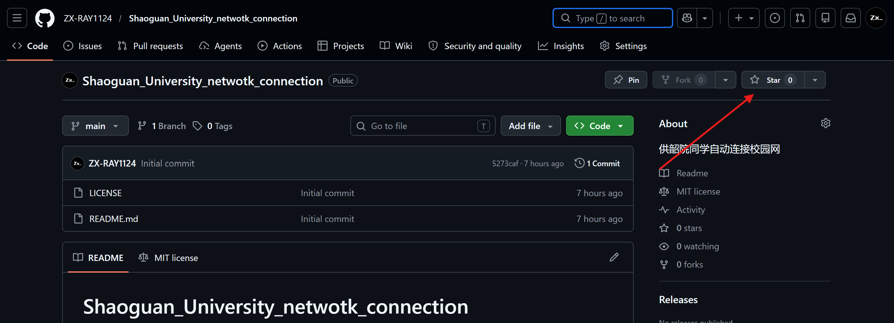

<div align="center">

# 韶关学院校园网自动连接系统

--------------


[](LICENSE)
[](https://python.org)
[](https://github.com/ZX-RAY1124/Shaoguan_University_netwotk_connection)

</div>

> 本脚本由化土学院 ZX_RAYER 制作  
> **使用库：** `selenium` `os` `sys`  
> **Python 版本：** 3.13  
> _MIT License_

# 🫵应用介绍   

是的，朋友，我知道连接校园网只需要用手点一下按钮就可以了

**但是……**

> ## 😅我真的懒得用手点😅
>> ### 😡长期坐轮椅上的迪客已经只剩格调了你知道吗😡
>>> #### 🤓不知道时间就是金钱吗🤓
>>>> ##### 😃有很深刻的教育意义不知道吗😃

**所以🤨**   

**朋友🫵**   

### 我开发了这款……🧐

## 🚀无需手指轮椅宇宙天雷勾地火陨石撞地球般超级无敌好用的校园网自动连接系统🚀

你可以叫他
> __勾石__

是的没错  
__这是校园网链接历史上值得被 铭 记 的 一 刻🤓__  
接下来  
__听 &ensp; 我 &ensp; 说__
---
# 🤗使用教程  
当你下载并解压应用后，路径如下  
```commandline
MAKE_CONNECTION
    ├─_internal<DIR>        #程序运行需要库
    ├─make_connection.exe   #主程序
    ├─properties.prop       #配置文件
    └─使用说明.txt           #使用说明
```
### 🫵特别提醒  
不要在程序运行期间修改`properties.prop`，该配置文件**不可删除**，删除会导致程序无法正常运行   
### 📄脚本使用方法  
1. 打开配置文件`properties.prop`，右键选择用记事本打开  
配置文件内容如下
```
name=2*********76
password=*******
waiting=true
power_on_start=true

使用说明：
请在name和password后面替换为您的账号密码
其中waiting为是否进行操作可视化，power_on_start为设置开机自启动,true表示启用，false表示禁用
如果开机自启动功能故障，请将power_on_start重新设为false，运行一次软件后再修改为true，再运行软件
```  
参数内容（你需要填上的）

|       参数       |         内容          |      注意事项      |
|:--------------:|:-------------------:|:--------------:|
|      name      |       你的校园网账号       |      别填错了      |
|    password    |         密码          |      别填错了      |
|    waitting    | 是否进行操作可视化，放慢每一步操作速度 | 只能填true或者false | 
| power_on_start |      是否设置开机自启动      |真的只能填true或者false，至于为啥不写窗口界面，因为开发者实在太懒（|

2. 点击 `make_connection.exe` 启动脚本  
__🚀启动脚本时候你会看到黑框，若开机自启出现停滞属于正常现象，不要在运行过程中关闭黑框🚀__  
3. 完成登录，程序自动退出  
4. 玩去吧
## 🤓为所有需要开机直连网的高雅人士们量身定制  
### 🤗赶紧下载，就是现在
# 如果您觉得好用，记得给本项目给个Star谢谢喵~本马楼真的靠这个生活的喵≧ ﹏ ≦   
  

真的就在这里，点一下喵~    


---
# 感谢喵，爱你喵！ヾ(≧ ▽ ≦)ゝ


