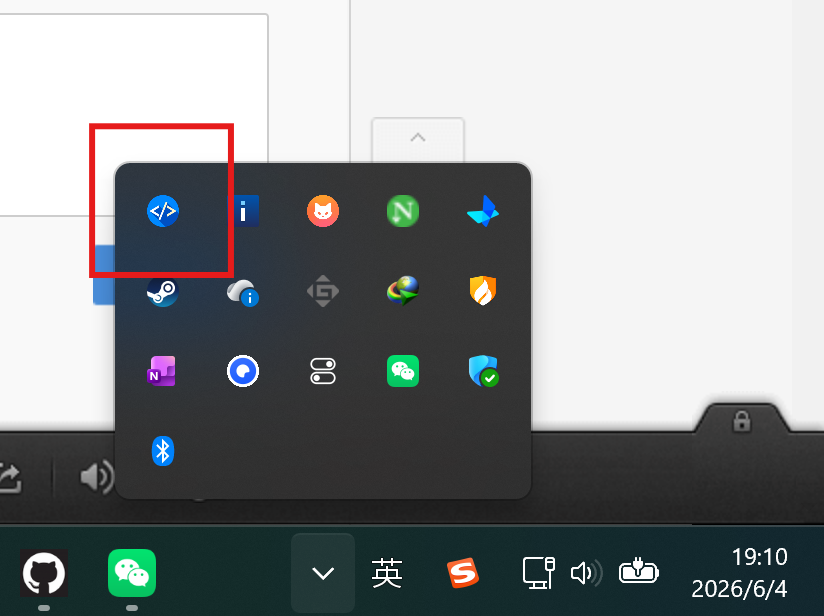
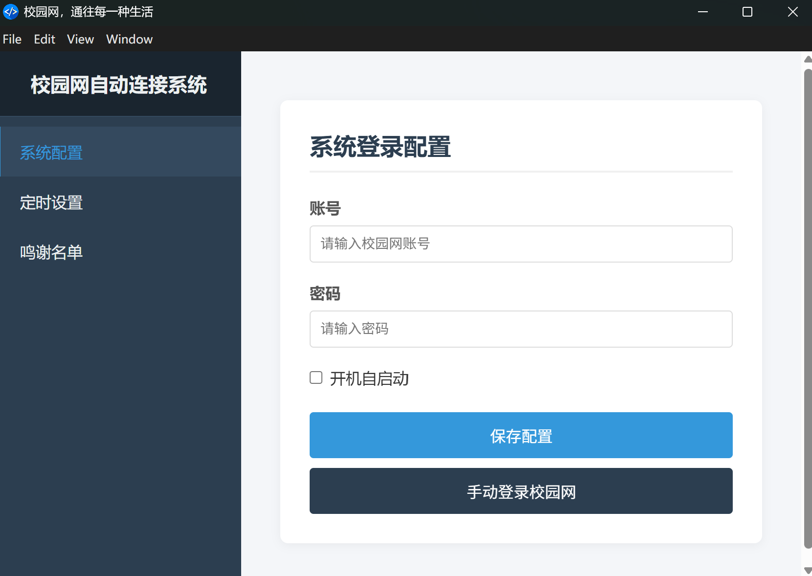
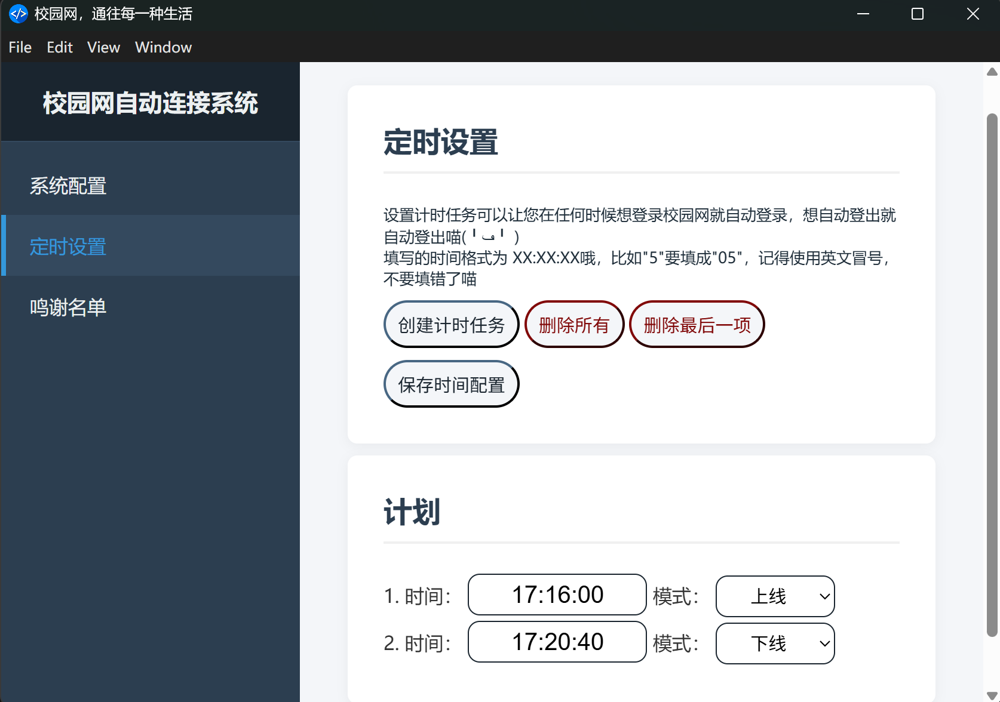
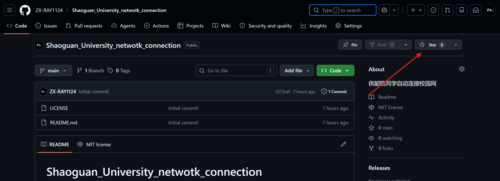

<iframe frameborder="no" border="0" marginwidth="0" marginheight="0" width=280 height=52 src="//music.163.com/outchain/player?type=2&id=28830412&auto=1&height=32"></iframe>

## 🤩-FASTER-🤩   
## 🤯?!HIGHER?!🤯   
## 😃!!STRONGER THAN BEFORE!!😃

> 软件开发者：化土学院 ZX_RAYER  
> 使用架构： `Nodejs` `electron`  
# 🫵朋友  
### 🤓欢迎来到🤓    

>🚀~~无需~~手指轮椅宇宙天雷勾地火陨石撞地球般超级无敌好用的校园网自动连接系统🚀  
> 🤗**Nodejs版本使用教程**🤗

# 🚀注意事项   
首先，朋友，你要知道程序是**后台运行**的，当你安装完之后打开软件，不会立刻出现窗口，因为软件在这里 🔽  
    
单击左键或者右键**打开设置面板**后你会看到这个界面   
   
下面，欢迎来到🫵   
## 核心教程🤩   
### 主界面📄
主页面填**账号密码**，**勾选复选框**后就可以使软件实现**开机自启动**，没什么好说的   
**一定要注意点完以后要点击保存配置！！！，不然刚才设置的不会保存！！，后面想要设置时间计划同理**   
### 定时计划🕟  
适合有定时启动需求的小可爱们，如果你想在校园网上手搓服务器，开启定时计划是不二之选，界面如下🔽  
   
时间栏中只能填一个时间。格式为 **XX:XX:XX**，模式有**上线，下线**选择，设置好时刻表后软件会按照时刻表执行任务，实现定时上网下线的功能！！！  
同样，**别忘记点保存时间配置**   
## 🤩是不是非常的NB呢🤩   
## 🤓写出这玩意感觉家里都得请高人了🤓   
朋友  
看在我们这么努力的份上   
给个Star不过分吧🥹   
我们以后还会继续努力为社区服务的喵ヾ(≧ ▽ ≦)ゝ  
## 最后
## 祝您拥有愉快的一天(╹ڡ╹ )
## 🤓为所有需要开机直连网的高雅人士们量身定制  
### 🤗赶紧下载，就是现在
# 如果您觉得好用，记得给本项目给个Star谢谢喵~本马楼真的靠这个生活的喵≧ ﹏ ≦   
  

真的就在这里，点一下喵~    

---
# 感谢喵，爱你喵！ヾ(≧ ▽ ≦)ゝ

